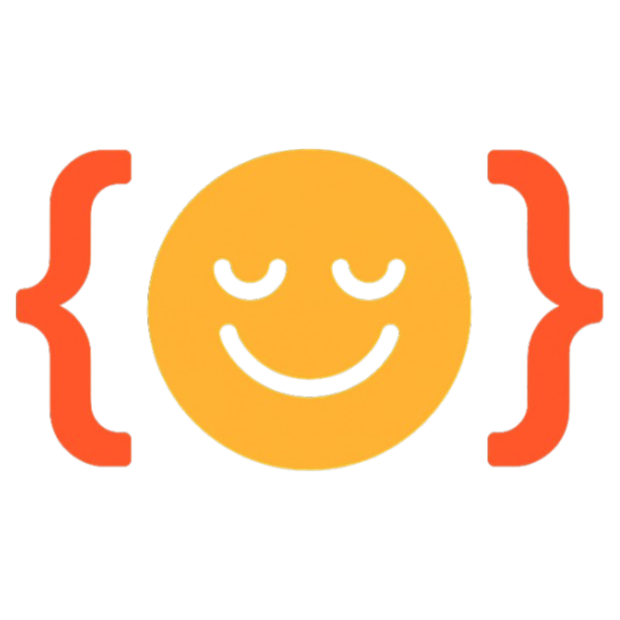

# MCPs for Humans

<div align="center">
  
  
  **A friendly GUI for managing Claude MCP (Model Context Protocol) configurations**
  
  *No more editing JSON files by hand. Connect Claude to external tools and data sources with a beautiful, intuitive interface.*
  
  [](https://mcpsforhumans.com/)
  [](https://opensource.org/licenses/MIT)
  [](https://github.com/your-username/mcps-for-humans/releases)
  
</div>

## ✨ What is MCPs for Humans?

MCPs for Humans transforms the way you configure Claude's MCP (Model Context Protocol) servers. Instead of manually editing JSON configuration files, you get an elegant desktop application that makes connecting Claude to external tools and data sources as simple as clicking a button.

## 🚀 Key Features

### 🎨 **Visual MCP Management**
- Beautiful, modern dark interface optimized for developer workflows
- Drag-and-drop server management
- Real-time configuration validation
- Smart command parsing with automatic quoting

### 🔧 **Easy Configuration**
- **Gallery of Popular Servers**: Pre-configured templates for Gmail, Google Docs, Salesforce, HubSpot, and more
- **Manual Entry**: Guided form interface for custom server configurations
- **JSON Import/Export**: Copy-paste support for existing configurations

### 🧪 **Live Testing**
- Test MCP configurations directly from the app
- Real-time error detection and debugging
- Detailed logs for troubleshooting
- Connection validation before saving

### 💾 **Smart Auto-Save**
- Automatic configuration backup
- Version history with restore capability

### 🌍 **Cross-Platform**
- Native apps for macOS (Intel & Apple Silicon)


## 📥 Download

Get the latest version for your platform:
## 🛠️ Development

### Prerequisites

- Node.js 16 or higher
- npm or yarn

### Setup

```bash
# Clone the repository
git clone https://github.com/samlevan/mcps-for-humans.git
cd mcps-for-humans

# Install dependencies
npm install

# Run in development mode
npm run dev
```

### Building for Distribution

#### Build for all platforms:
```bash
npm run build
```

#### Build for specific platforms:
```bash
# macOS only
npm run build:mac

# macOS signed and notarized (requires Apple Developer account)
npm run build:mac:signed

# Windows only
npm run build:win

# Linux only
npm run build:linux
```

#### Development builds:
```bash
# Create unpacked directory (faster for testing)
npm run pack

# Create distributable packages
npm run dist
```

### Build Output

Built applications will be saved in the `dist/` directory:

- **macOS**: `.dmg` and `.zip` files
- **Windows**: `.exe` installer and `.zip` files  
- **Linux**: `.AppImage` and `.deb` packages

## 🤝 Contributing

We welcome contributions! Whether it's:

- 🐛 Bug reports and fixes
- ✨ New feature suggestions
- 📝 Documentation improvements  
- 🔌 New MCP server integrations

Please feel free to submit a Pull Request or open an issue.

## 📜 License

MIT License - Open source. Free forever. Built with ❤️ for the Claude community.

---

<div align="center">
  
**[Visit mcpsforhumans.com](https://mcpsforhumans.com/) • [Download Latest Release](https://github.com/your-username/mcps-for-humans/releases/latest) • [Report Issues](https://github.com/your-username/mcps-for-humans/issues)**

</div> 